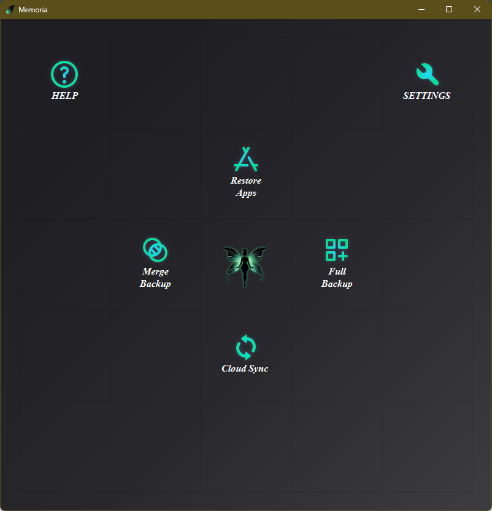
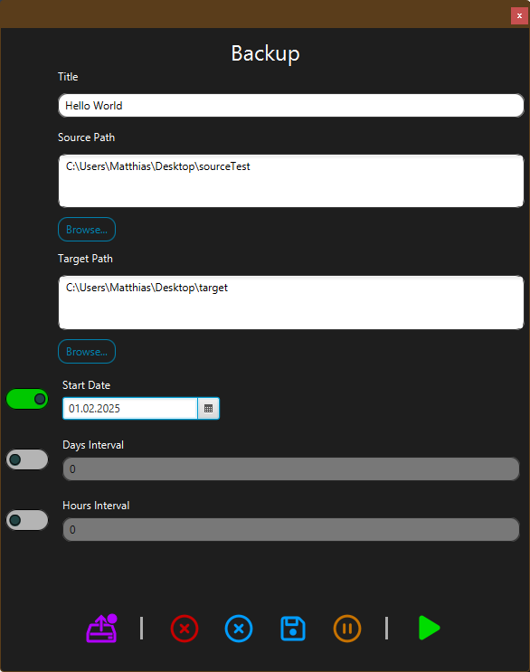
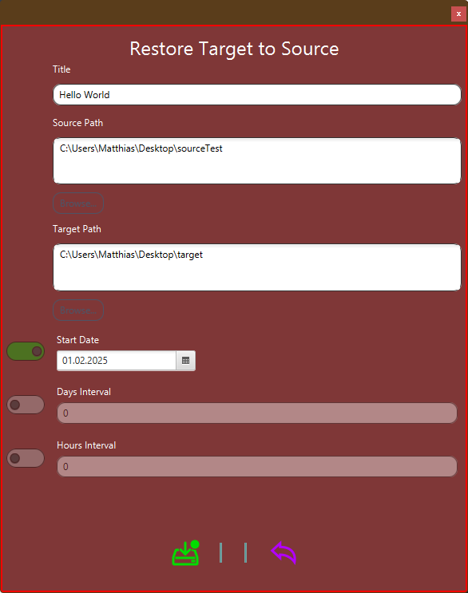

# ccBackup Tool

## Table of Contents
1. [Introduction](#introduction)
2. [Features](#features)
   - [Merge Backup](#merge-backup)
   - [Full Backup](#full-backup)
   - [App Reinstaller](#app-reinstaller)
   - [Cloud Synchronization](#cloud-synchronization)
3. [Conclusion](#conclusion)

---

## Introduction
The ccBackup Tool is designed to be simple and intuitive. Its primary goal is to allow quick and easy configuration, making it ideal for users who like it simple.

###Main Window

---

## Features

### Merge Backup
This feature ensures that the old backup is overwritten each time, reducing memory usage compared to other backup methods.  
It allows customization of the local date, time, source, and target paths for backups. You can create an unlimited number of backup instances, all of which are displayed in the tool's overview window.

### Full Backup
Provides a complete backup of all selected files and directories. You can adjust the Timing and Number of Backups which will kept in store.

### App Reinstaller
Allows users to back up and restore application settings and data.  
The Apps are nor saved only the Informations about them. The installer will download and install this Apps.

### Cloud Synchronization
Synchronizes in tho ways. In and from Target and Source Folder.  
Timing can be Adjusted on creation.

---

## Conclusion
An MSI installer link is coming.
