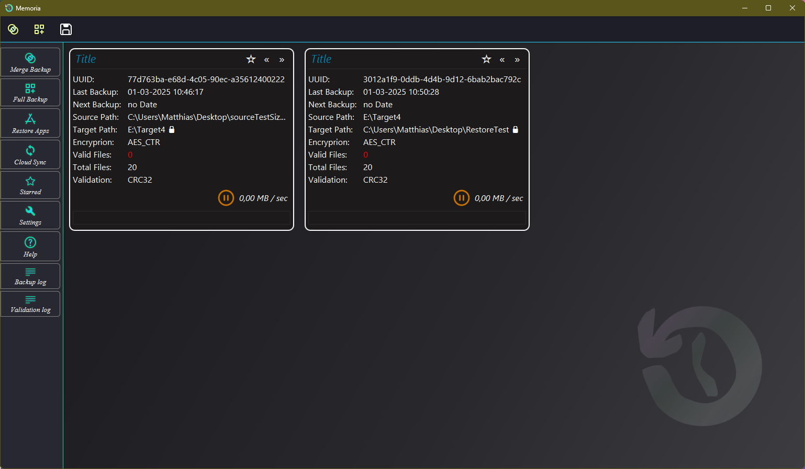
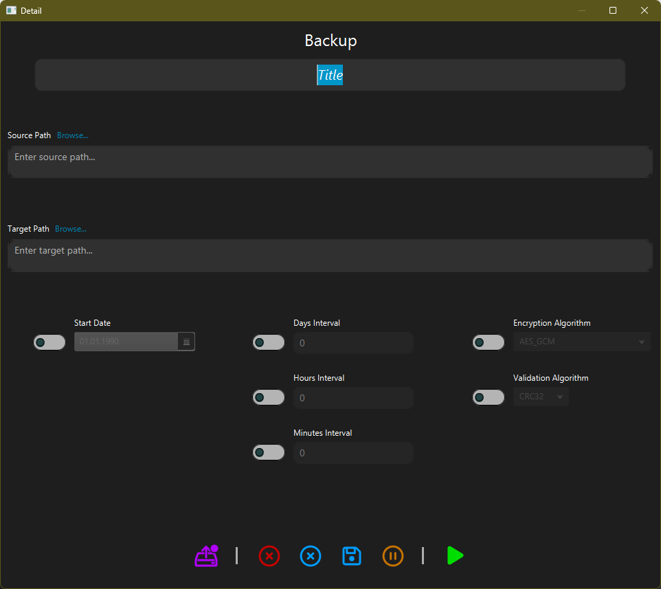
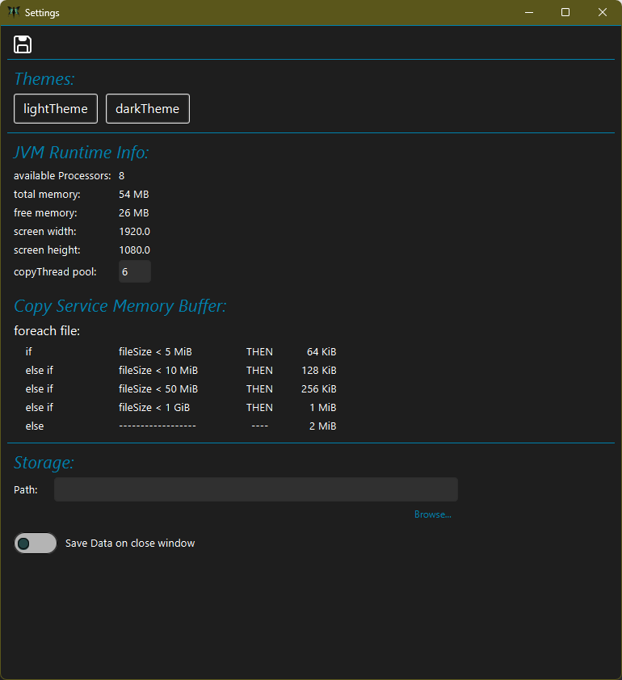
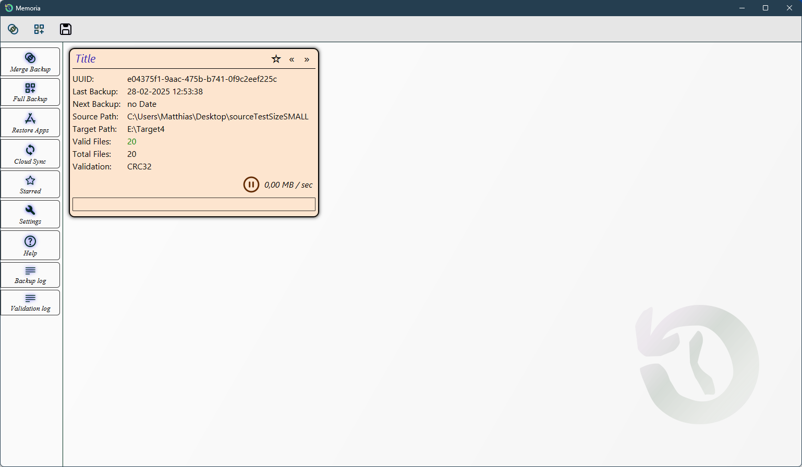
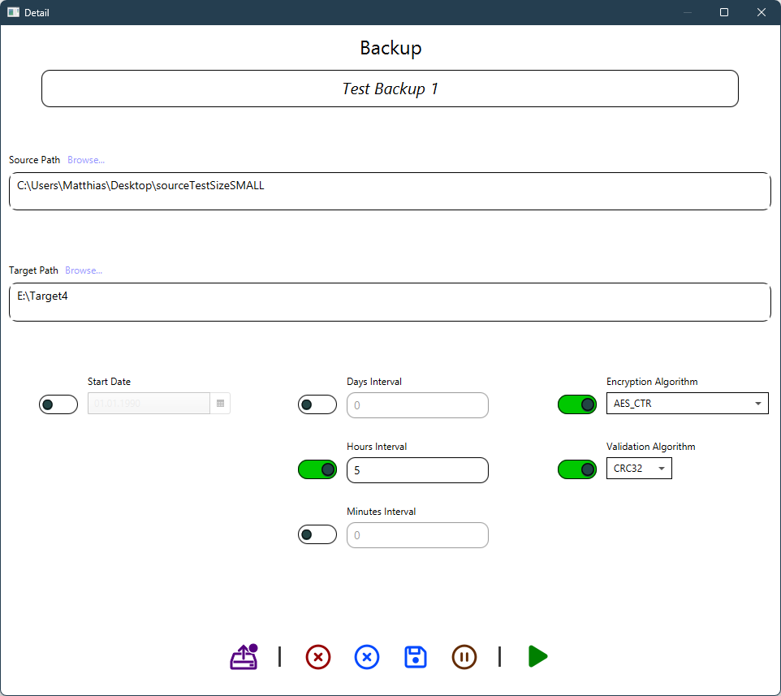

# Backup Tool

## Table of Contents
1. [Introduction](#introduction)
2. [Features](#features)
   - [Merge Backup](#merge-backup)
   - [Full Backup](#full-backup)
   - [App Reinstaller](#app-reinstaller)
   - [Cloud Synchronization](#cloud-synchronization)
3. [Conclusion](#conclusion)
4. [License](#license)
5. [Installation](#installation)
6. [Screenshots](#screenshots)

## Introduction  
This project started as a trainee software project focused on:
- Threading
- GUI design in Java
- MVC Pattern 
- working with files (read write attributes)

Now many things are completed and I want to prepare a release version ( starting with Merge Backup Feature ).
I developed everything on my own and nobody tested this.
Over the next few weeks, I will improve and refactor the code and upload an alpha test installer.
Please test my software and let me know your feedback or report any issues.
Take a look at the screenshots to get an overview of all features.

## Features
Every Copy Service works with NIO File Channel. Encryption with javax.crypto.
``` java
import javax.crypto.*;
import java.nio.channels.FileChannel;
```

### Merge Backup
Creates new files and directories.
Overrides changes using last modified Date.
Doesn't copy any unchanged files. 

### Full Backup
Feature is not finished.
Not started.
Creates a new Instance of the selected source directory into target directory.

### App Reinstaller
Feature is not finished.
Reinstall all Apps.
Reloads all remembered Apps from web. 

### Cloud Synchronization
Not finished. Not started.

### AES Encryption
The content of a File is Encrypted. Not the Metadata.
The AES_CTR encryption mode can be validated using the Validation feature and provides large file transfers.
The AES_CTR Encryption works but without Validation at the moment.
The AES_GCM Encryption works but is limited to 2GiB Filesize.

### Validation
I checked every single source file and target file with a CRC32 or hash algorithm.
The log file writer only logs wrong values (Validation log).
CRC32 Checksum from each file is ready.
SHA256 is not finished now.

## Conclusion
Only the Merge Backup feature is ready for testing.
An installer will be provided so you can test it without pulling.

## License
I copied the license from:  

https://choosealicense.com/community/ 

[license.txt](license.txt)

## Installation  
Download and run it in an IDE (IntelliJ).  
Dependencies are managed with Maven.  
I will create an installer for testing **merge backups, settings, restore, encryption, and validation** in a few weeks.  

## Screenshots

### Dark Theme




### Light Theme




