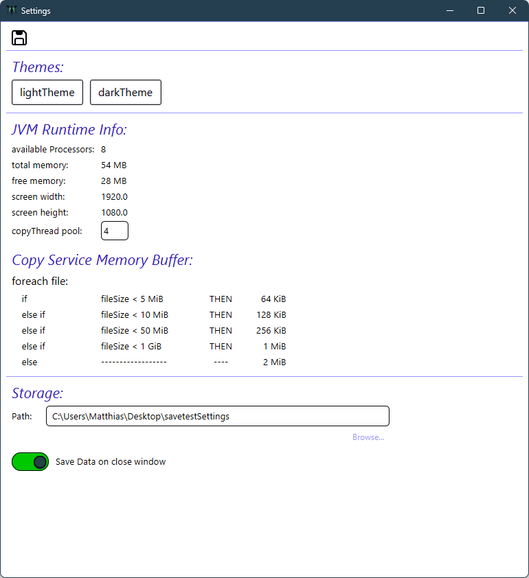

# Backup Tool

## Table of Contents
1. [Introduction](#introduction)
2. [Features](#features)
   - [Merge Backup](#merge-backup)
   - [Full Backup](#full-backup)
   - [App Reinstaller](#app-reinstaller)
   - [Cloud Synchronization](#cloud-synchronization)
3. [Conclusion](#conclusion)

---

## Introduction
 

###Main Window

---

## Features

### Merge Backup
Creates new files and directories.
Overrides changes using last modified Date.
Doesn't copy any unchanged files. 

### Full Backup
Feature is not finished.
Not started.
Creates a new Instance of the selected source directory into target directory.

### App Reinstaller
Feature is not finished.
Reinstall all Apps.
Reloads all remembered Apps from web. 

### Cloud Synchronization
Not finished. Not started.

---

### AES Encryption
The content of a File is Encrypted. Not the Metadata.

### Validation
CRC32 Checksum from each file is ready.
SHA256 is not finished now.

---

## Conclusion
Only the Merge Backup feature is ready for testing.
An installer will be provided so you can test it without pulling.
